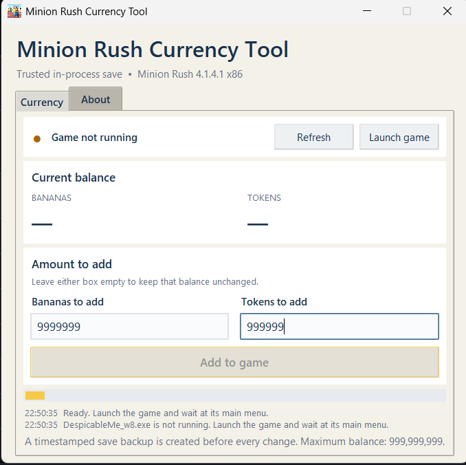
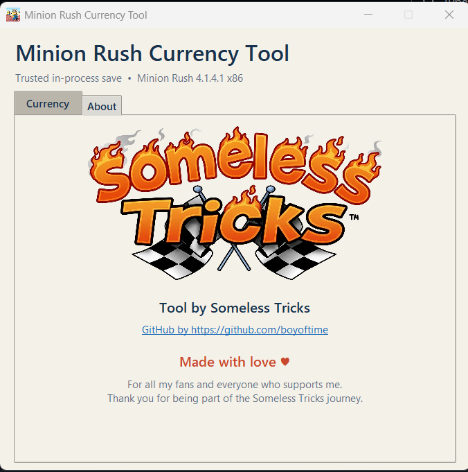

<h1 align="center">🍌 Minion Rush Currency Tool</h1>

<p align="center">
  A simple Windows tool for adding custom Bananas and Tokens to Minion Rush.
</p>

<p align="center">
  
  
  
  
</p>

<p align="center">
  <a href="https://www.mediafire.com/file/j8cid0dtv4d1mmo/MinionRushCurrencytool.zip/file">
    
  </a>
  <a href="https://youtu.be/rdnpTLByfWQ">
    
  </a>
</p>

---

## 🖥️ GUI Preview

<p align="center">
  A clean and simple interface designed for quick currency editing.
</p>

<table>
  <tr>
    <td align="center" width="50%">
      <strong>🍌 Currency Tool</strong>
    </td>
    <td align="center" width="50%">
      <strong>❤️ About & Credits</strong>
    </td>
  </tr>
  <tr>
    <td align="center">
      
    </td>
    <td align="center">
      
    </td>
  </tr>
</table>

<p align="center">
  <sub>Currency controls, live game detection, safety backups, and project credits.</sub>
</p>

---

## ✨ About the Tool

**Minion Rush Currency Tool** is a portable Windows application that lets you add a custom amount of Bananas and Tokens to the supported PC version of Minion Rush.

Instead of copying a save file created on another computer, the tool communicates with the running game and asks the game to apply, protect, and save the new balances using its own native routines.

This makes the resulting save valid for the computer on which it was created.

## ✅ Features

- 🍌 Add a custom number of Bananas
- 🪙 Add a custom number of Tokens
- 📊 Display the current in-game balances
- 💾 Create a timestamped backup before every change
- 🔍 Verify the exact supported game build before writing
- ✅ Confirm that the protected save changed successfully
- 🖥️ Simple and responsive graphical interface
- 📐 Fixed and non-resizable window
- 📦 Standalone EXE — Python is not required
- 🚫 No CMD or PowerShell scripts required
- ❤️ Someless Tricks branding and credits

> [!IMPORTANT]
> The values entered are amounts to **add**, not the final balances.  
> Leave either field empty if you do not want to change that currency.

## 🎯 Supported Game Build

| Requirement | Supported value |
|---|---|
| Game | Despicable Me: Minion Rush |
| Version | `4.1.4.1` |
| Architecture | `x86` |
| Executable | `DespicableMe_w8.exe` |
| Windows | 64-bit Windows 10 or Windows 11 |
| Maximum balance | `999,999,999` |

Supported executable SHA-256:

```text
759E0CFA785E03AD93199565D9AF852CBC1CA355BEFD223C4FD5686A817D3A13
```

The tool intentionally refuses to modify unknown or incompatible game builds.

## 🚀 How to Use

1. Download the Currency Tool.
2. Extract the downloaded ZIP file.
3. Launch Minion Rush normally.
4. Wait until the game reaches its main menu.
5. Open `MinionRushModder.exe`.
6. Confirm that the tool detects the running game.
7. Enter the Bananas and/or Tokens you want to add.
8. Click **Add to Game**.
9. Wait for the success confirmation.
10. Restart the game to confirm that the balances were saved.

> [!NOTE]
> The game and the Currency Tool must run under the same interactive Windows account.

## 🧠 How It Works

The tool uses a **trusted in-process save update**:

```text
Launch the supported game
          ↓
Verify the running process and executable
          ↓
Read the current protected balances
          ↓
Create a safety backup
          ↓
Call the game's native currency and save routines
          ↓
Verify the new balances and encrypted save
```

The game performs its own protection, encoding, and save operation. An encrypted save from another computer is not copied or reused.

## 💾 Safety Backups

A new backup is created before every attempted change:

```text
%LOCALAPPDATA%\MinionRushNativeMod\Backups
```

Keep these backups until you have restarted the game and confirmed that everything works correctly.

## 🛠️ Troubleshooting

| Problem | Solution |
|---|---|
| Game not running | Launch Minion Rush and wait at the main menu |
| Unsupported game build | Confirm that you have version `4.1.4.1 x86` |
| Add button is disabled | Click **Refresh** after reaching the game menu |
| Access denied | Run the game and tool under the same Windows account |
| Balance is unchanged | Restart the game and check the balance again |
| Antivirus warning | Review the source or build it yourself instead of disabling Windows security |

## 🧑‍💻 Running From Source

Python 3.10 or newer is required when running the source version:

```powershell
python .\minion_native_gui.py
```

To inspect the protected balances without changing them:

```powershell
python .\minion_native_mod.py --read-only
```

More technical details are available in:

[📖 NATIVE-MOD-README.md](./NATIVE-MOD-README.md)

## 📥 Download

Download the standalone Windows Currency Tool:

[](https://www.mediafire.com/file/j8cid0dtv4d1mmo/MinionRushCurrencytool.zip/file)

No Python, CMD, or PowerShell installation is required.

## ⚠️ Disclaimer

This is an unofficial, fan-made utility created for educational and personal use.

- Use it only with game files you legally own.
- Always keep a backup of your save.
- Never download unknown copies from untrusted sources.
- This project is not affiliated with Gameloft, Illumination, Universal, or their partners.
- Use the tool at your own risk.

## ❤️ Credits

<p align="center">
  <strong>Tool by Someless Tricks</strong>
</p>

<p align="center">
  GitHub by <a href="https://github.com/boyoftime">@boyoftime</a>
</p>

<p align="center">
  Made with ❤️ for all the fans and supporters of Someless Tricks.
</p>

---

<p align="center">
  ⭐ If this project helped you, please give the repository a star!
</p>
